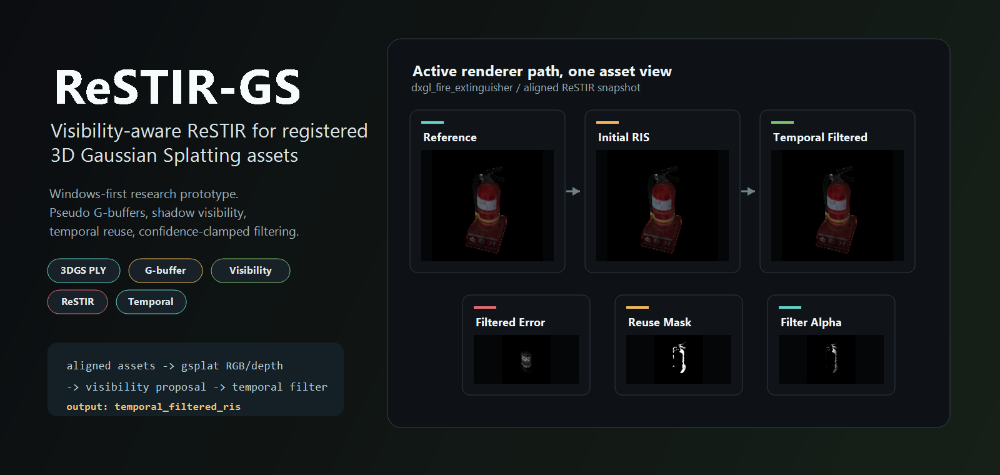
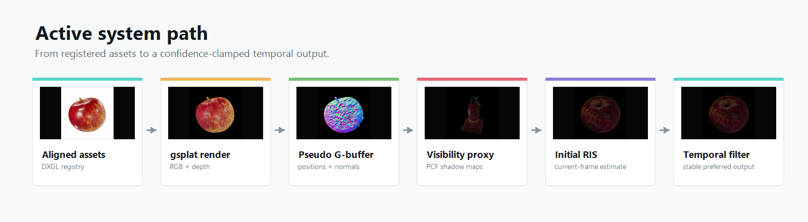
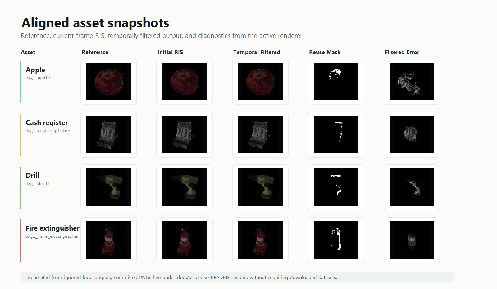

# ReSTIR-GS

Windows-first research prototype for visibility-aware ReSTIR on registered 3D Gaussian Splatting assets.

<p align="center">
  
</p>

The current implementation has one active path:

```text
configs/aligned_assets.json
-> aligned asset registry
-> DXGL dataset adapter
-> compatible 3DGS PLY loader
-> gsplat RGB + expected-depth render
-> pseudo G-buffer
-> scene-stable world-space lights
-> PCF shadow-map visibility proxy
-> visibility-geometric light proposal
-> initial RIS
-> previous-frame temporal reuse
-> confidence-clamped temporal-filtered output
```

The preferred output is `temporal_filtered_ris`. `initial_ris` is the current-frame estimate, and `temporal_ris` is retained as a reservoir-combine debug output.

## Visual Overview

These README images are built from local renderer outputs and committed under `docs/assets/` so the project renders without requiring downloaded datasets.





## Quick Start

Use the `restirgs` conda environment. If rebuilding it, install the conda environment first and then the pip requirements:

```powershell
conda env create -f environment.yml
conda activate restirgs
python -m pip install -r requirements.txt
```

On Windows, use the `.bat` viewer runners for CUDA and `gsplat` inspection.
They set the Visual Studio/CUDA environment, torch extension cache, and
`gsplat` Windows patch check. The current renderer policy is:

```text
target_mode = visibility
proposal = visibility_geometric
visibility_shadow_pcf_radius = 1
temporal_reprojection_search_radius = 1
temporal_history_m_cap = 1
```

Download the aligned testing assets:

```powershell
python scripts/download_aligned_asset.py --asset-set testing --dry-run
python scripts/download_aligned_splat.py --asset-set testing --dry-run
python scripts/download_aligned_asset.py --asset-set testing
python scripts/download_aligned_splat.py --asset-set testing
```

Inspect a registered aligned asset:

```powershell
$env:RESTIRGS_VIEWER_ASSET_ID="dxgl_apple"
scripts\run_interactive_viewer_windows.bat
```

The full validation and test runners are retained on the `dev` branch. The
published `main` branch keeps the deliverable inspection surface only.

## Active Assets

The active manifest is `configs/aligned_assets.json`.

```text
asset_sets.smoke   = dxgl_apple
asset_sets.testing = dxgl_apple, dxgl_cash_register, dxgl_drill, dxgl_fire_extinguisher,
                     dxgl_led_lightbulb, dxgl_measuring_tape, dxgl_modern_arm_chair,
                     dxgl_multi_cleaner_5l, dxgl_potted_plant, dxgl_wet_floor_sign
```

Downloaded/source assets stay under ignored `data/`; generated outputs stay under ignored `outputs/`.

## Generated Outputs

Viewer saves write ignored local artifacts under:

```text
outputs/interactive_viewer/current_camera.json
outputs/interactive_viewer/current_rgb.png
outputs/interactive_viewer/current_alpha.png
outputs/interactive_viewer/current_normal.png
outputs/interactive_viewer/current_blinn_phong.png
outputs/interactive_viewer/current_visibility_ris.png
outputs/interactive_viewer/current_visibility_reference.png
outputs/interactive_viewer/current_visibility_error.png
outputs/interactive_viewer/interactive_viewer_save_summary.json
```

The visibility reference and error images are written only when
`--save-visibility-reference` is requested. Historical validation CSVs,
demo snapshots, and performance summaries are maintained on the `dev` branch,
not shipped as active commands on published `main`.

## Interactive Inspection

Matplotlib viewer:

```powershell
$env:RESTIRGS_VIEWER_ASSET_ID="dxgl_apple"
scripts\run_interactive_viewer_windows.bat
```

Browser viewer:

```powershell
$env:RESTIRGS_VIEWER_ASSET_ID="dxgl_apple"
scripts\run_interactive_web_viewer_windows.bat
```

Open:

```text
http://127.0.0.1:8765
```

Useful viewer controls:

```text
W/S            move forward / backward
A/D            move left / right
Shift/Ctrl     move up / down
left drag      orbit yaw/pitch
shift+left     pan camera target
wheel          dolly focus distance
[ / ]          previous / next aligned frame
1-6            RGB / Alpha / Depth / Normal / Lambertian / Blinn-Phong diagnostics
Ctrl+S         save current camera and previews
q              quit
```

The viewer display path is intentionally lighter than the evaluator path. Save the display-side visibility result with:

```powershell
$env:RESTIRGS_VIEWER_ASSET_ID="dxgl_apple"
$env:RESTIRGS_VIEWER_EXTRA_ARGS="--save-and-exit --save-visibility"
scripts\run_interactive_viewer_windows.bat
```

Request all-lights reference/error output only when needed:

```powershell
$env:RESTIRGS_VIEWER_ASSET_ID="dxgl_apple"
$env:RESTIRGS_VIEWER_EXTRA_ARGS="--save-and-exit --save-visibility-reference"
scripts\run_interactive_viewer_windows.bat
```

Generic compatible 3DGS PLY inspection is also supported:

```powershell
python -m interactive.launcher --ply path\to\asset.ply --device cuda
python -m interactive.web_server --ply path\to\asset.ply --device cuda
```

## Repository Layout

```text
configs/       aligned asset manifest
data/          ignored local data root, with tracked layout notes
restir_gs/     renderer, lighting, ReSTIR, metrics, and eval helpers
interactive/   matplotlib and browser viewer frontends
gs_gen/        standalone local Gaussian asset generation helper
scripts/       asset download helpers and interactive viewer runners
docs/          maintained architecture, workflow, and handoff docs
outputs/       ignored assets, renders, metrics, and snapshots
```

Important implementation files:

```text
restir_gs/render/aligned_asset_registry.py
restir_gs/render/dxgl_asset.py
restir_gs/render/ply_loader.py
restir_gs/render/gbuffer.py
restir_gs/lighting/asset_lights.py
restir_gs/lighting/shadow_maps.py
restir_gs/lighting/shadow_visibility.py
restir_gs/lighting/visible_lighting.py
restir_gs/lighting/visibility.py
restir_gs/restir/proposal.py
restir_gs/restir/visibility.py
restir_gs/restir/temporal.py
restir_gs/restir/renderer.py
interactive/launcher.py
interactive/rendering.py
interactive/session.py
interactive/viewer.py
interactive/web_server.py
```

## Local Asset Generation

`gs_gen/` is a standalone helper for planning, validating, and staging local Gaussian Splatting assets. It does not modify `configs/aligned_assets.json` and is not part of the active renderer source path.

Example:

```powershell
python -m gs_gen probe-source --images data\gs_gen\room_capture\my_room\images
python -m gs_gen plan --asset-id my_room --images data\gs_gen\room_capture\my_room\images
python -m gs_gen validate --dataset-root outputs\gsgen\my_room\processed --splat outputs\gsgen\my_room\export\splat.ply
python -m gs_gen stage --asset-id my_room --dataset-root outputs\gsgen\my_room\processed --splat outputs\gsgen\my_room\export\splat.ply --copy-images
```

See `gs_gen/README.md` for the full helper workflow.

## Verification

Useful checks:

```powershell
conda activate restirgs
python -m compileall restir_gs scripts interactive gs_gen
python -m pip check
```

The full validation suite is retained on the `dev` branch. The published
`main` branch intentionally excludes tracked test files.

## Current Boundaries

- The active renderer starts from registered aligned assets in `configs/aligned_assets.json`.
- Visibility is a shadow-map proxy, not exact physical visibility.
- Pseudo normals are reconstructed from expected-depth positions.
- Temporal reuse is previous-frame only.
- `temporal_filtered_ris` is a conservative stabilization layer, not proof that temporal reuse wins for every frame.
- The interactive viewer is an inspection tool, not a production real-time renderer.
- Diffuse rendering is retained for diagnostics/debugging, but the active deliverable path is visibility-aware direct lighting.

## More Documentation

Start here:

```text
docs/README.md
docs/active_workflow.md
docs/active_baseline_handoff.md
docs/current_architecture.md
docs/current_milestone_snapshot.md
scripts/README.md
gs_gen/README.md
```
