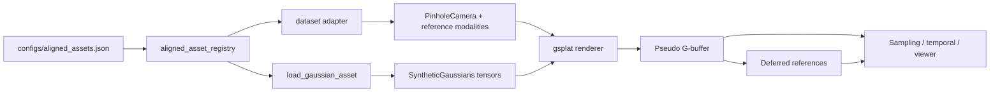

# Current Architecture

This document summarizes the active ReSTIR-GS prototype architecture after Phase 37. The current expansion surface is registry-driven aligned assets plus the consolidated visibility-aware aligned ReSTIR renderer path, not Apple-specific scripts or non-aligned single-view diagnostics.

## Active Path

The active workflow is:

```text
configs/aligned_assets.json
-> aligned_asset_registry
-> dataset adapter
-> load_gaussian_asset
-> smoke matrix / aligned ReSTIR renderer / viewer
```

In more concrete terms:

```text
aligned asset manifest
-> dataset-specific camera and modality adapter
-> dataset-agnostic compatible 3DGS PLY loader
-> gsplat RGB + expected-depth + alpha render
-> pseudo G-buffer
-> visibility-aware all-lights reference
-> MC/RIS, compatibility-gated temporal renderer, viewer, or smoke scripts
```

The default manifest now separates asset facts from run selection:

```text
assets     = registered datasets and splat paths
asset_sets = smoke/testing groups for commands
```

The active `testing` set contains `dxgl_apple`, `dxgl_cash_register`, `dxgl_drill`, and `dxgl_fire_extinguisher`. Adding a new aligned object should start with a new manifest entry and, when appropriate, an asset-set update. New object-specific scripts are not the preferred extension path.

## Data Flow



## Core Modules

`restir_gs.render`

- `aligned_asset_registry.py`: manifest parsing, path resolution, and registered aligned asset loading.
- `dxgl_asset.py`: DXGL-specific dataset adapter for transforms, modalities, normalization, and camera scaling.
- `ply_loader.py`: dataset-agnostic compatible 3DGS PLY loader. It supports GraphDECO/Nerfstudio-style fields and keeps `load_gaussian_ply_with_stats` compatibility.
- `transforms_loader.py`: imports Nerfstudio/OpenGL-style camera-to-world transforms into the project convention.
- `scene_normalization.py`: infers raw dataset to splat-space similarity transforms where the dataset adapter needs them.
- `orbit_camera.py`: dataset-agnostic orbit camera controls used by the interactive viewer.
- `gsplat_renderer.py`: wraps `gsplat.rasterization` and returns RGB, expected depth, and alpha.
- `gbuffer.py`: builds pseudo G-buffer position, normal, and validity masks.
- `synthetic_scene.py`: shared tensor dataclasses, especially `SyntheticGaussians` and `PinholeCamera`.

`restir_gs.lighting`

- `asset_lights.py`: deterministic asset-scaled lights, including world-space lights for aligned temporal reuse and camera-space lights for older single-frame paths.
- `deferred.py`: all-lights Lambertian and Blinn-Phong references plus selected-light evaluators.
- `visibility.py`: expected-depth shadow-map proxy for visibility-aware Lambertian smoke tests.

`restir_gs.restir`

- `proposal.py`: uniform sampling support, the current geometric proposal distribution, and the visibility-geometric proposal used by the visibility target.
- `initial.py`: initial MC/RIS estimators. Diffuse remains the default target; Blinn-Phong is opt-in.
- `visibility.py`: optional initial MC/RIS estimators for the Phase 33 shadow-proxy visible direct-light target.
- `temporal.py`: aligned temporal reprojection, depth/normal/RGB/motion compatibility gates, and carried reservoir combination.
- `renderer.py`: composition layer for all-lights reference, target-derived proposal, initial RIS, and previous-frame temporal reservoir reuse. The active runner uses the visibility target; diffuse remains a compatibility baseline.
- `spatial_mis.py`: retained defensive spatial MIS support from earlier real-asset diagnostics.

`restir_gs.eval`

- `restir_gs.metrics`: shared RGB error metric helper used by eval and renderer code without introducing eval/restir import cycles.
- `gbuffer_validation.py`: masked RGB, alpha, depth, and normal-display diagnostics.
- `dxgl_sampling_benchmark.py`: aligned multi-frame MC/RIS benchmark helper.
- `proposal_ablation.py`, `real_asset_benchmark.py`, and `spatial_mis_ablation.py`: retained for compatibility and historical diagnostics.

## Active Commands

Use the generic aligned asset entrypoints first:

```powershell
python scripts/download_aligned_asset.py --asset-set testing --dry-run
python scripts/download_aligned_splat.py --asset-set testing --dry-run
python scripts/download_aligned_asset.py --asset-set testing
python scripts/download_aligned_splat.py --asset-set testing
scripts\run_aligned_asset_smoke_matrix_windows.bat
scripts\run_aligned_restir_renderer_windows.bat
scripts\run_active_validation_windows.bat
```

Optional visibility-target diagnostics:

```powershell
scripts\run_aligned_visibility_smoke_windows.bat
scripts\run_aligned_visibility_ris_smoke_windows.bat
scripts\run_aligned_visibility_smoke_matrix_windows.bat
scripts\run_visibility_validation_windows.bat
```

The active Windows runners share `scripts\_setup_windows_cuda_env.bat` for VS x64, conda CUDA paths, torch extension cache, matplotlib cache, and `gsplat` patch checks.

The smoke matrix writes:

```text
outputs/aligned_smoke/aligned_asset_smoke_rows.csv
outputs/aligned_smoke/aligned_asset_smoke_summary.json
outputs/aligned_smoke/<asset_id>/contact.png
```

The aligned ReSTIR renderer writes:

```text
outputs/aligned_restir/restir_renderer_rows.csv
outputs/aligned_restir/restir_renderer_summary.json
outputs/aligned_restir/<asset_id>/contact.png
```

The active renderer output is expected to record `target_mode=visibility` and `proposal=visibility_geometric`. To run the retained diffuse baseline, set `RESTIRGS_RESTIR_TARGET_MODE=diffuse` and write to `outputs\aligned_restir_diffuse`.

Useful aligned validation and debugging commands:

```powershell
scripts\run_dxgl_gbuffer_validation_windows.bat
scripts\run_dxgl_blinn_phong_lighting_windows.bat
scripts\run_dxgl_sampling_benchmark_windows.bat
scripts\run_dxgl_temporal_reuse_windows.bat
scripts\run_interactive_viewer_windows.bat
```

## Compatibility And History

These scripts remain available, but they are not the active expansion surface:

- `scripts/download_dxgl_apple.py`
- `scripts/download_dxgl_apple_splat.py`
- `scripts/demo_17_dxgl_aligned_intake.py`
- Voxel51 benchmark scripts and docs
- Single-view real-asset camera probe and proposal-ablation scripts
- Naive spatial reservoir diagnostic scripts

See `docs/legacy_inventory.md` for the retained historical surface and why it is not deleted.

## Current Baseline Conclusions

1. The active aligned path is technically healthy: manifest loading, dataset adapter, generic Gaussian loader, renderer, G-buffer, visibility-aware lighting, viewer, and smoke rows run end to end.
2. The generic Gaussian loading boundary is `load_gaussian_asset(...)`; dataset-specific normalization stays in dataset adapters.
3. World-space light identities are stable for aligned temporal reuse, and history reuse is now gated by depth, world-normal, RGB, and motion compatibility.
4. The aligned testing set is manifest-first: use `asset_sets.testing` for multi-asset smoke and the aligned renderer path before adding research logic.
5. The visibility target is the preferred active renderer target and uses the visibility-geometric proposal by default.
